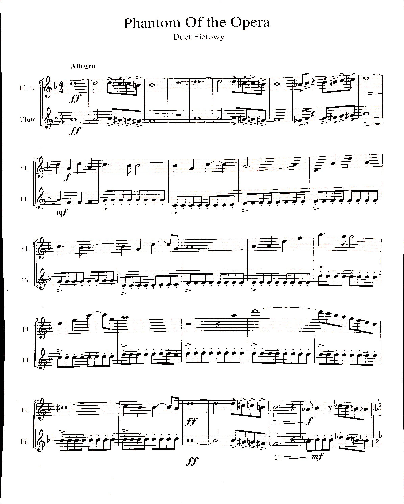

# Document Scanner
A camera based document scanner using OpenCV

 

*It works with colored images as well*

## Getting started
These instructions will get you a copy of the project up and running on your local machine for development and testing purposes.

### Pre requisites
- [Python 3.x](https://www.python.org/downloads/)
- OpenCV 3 or later
- Numpy

You can install an unofficial pre-built OpenCV package for Python using pip:

```
pip install opencv-python
```

For installing Numpy just run

```
pip install numpy
```

You can also build this libraries from the source, but it's easier to use pip

## Running

You can use the program to scan a file in a real time video or an image file.

### Video version
After installing everything, simply open open your terminal, navigate to the folder your downnloaded "main.py" file is and type

```
python main.py
```

If you have more than one version of python installed on you computer you may have to specify it

```
python3 main.py
```

### Image version
The process is similar to the video one. You just need to specify the path to the image as an argument to run it.

```
python main.py -i path/to/the/image.extension
```

## Interface

Once the program starts, 2 screens are going to open. One shows the image/video and the other shows 2 trackbars in which you can control the threshold values. These values correspond to the detector's "sensibility"

When a squared object (paper, photo, card, etc..) is detected, some blue dots will appear on the image. This blue dots correspond to the edges of the object. You can adjust those threshold values unitll your region of interest is detected

If you are satisfied with the object detection, you can press 's' to save the region of the image selected or 'esc' to quit. A new folder called 'Scanned' is going to be created (if it doesn't already exists) and your scanned file is going to be saved there

Obs.:
- If your image is to big it may not fit your screen during the scanning, but the saved file is going to be full
- More detailed images work better with this algorithm.
      
## Meta

Isaac Rabello – [@younes_isaac](https://twitter.com/younes_isaac) – igyrabello@gmail.com

Distributed under the GPL v3 license. See ``LICENSE`` for more information.

[https://github.com/isaacyounes04/](https://github.com/isaacyounes04/)
